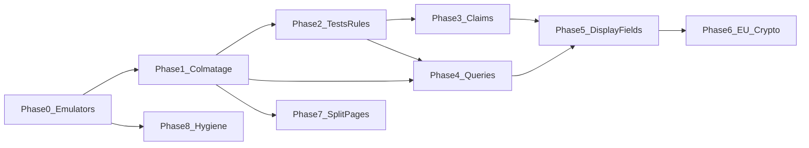

# Plan de mise à l'échelle multi-tenant (JSaaS)

> Une phase = une branche = une PR. Aucun `git push --force`. Produit en production : migrations idempotentes, dry-run, rollback documenté.

## Verdict sur le séquencement

**L’ordre Phase 0 → 8 est correct.** Pas de validation émulateur/CI ⇒ bascule claims dangereuse ; étanchéité avant perf ; conformité après fuites closes. **Pas de second projet Firebase** : un seul `jsaas-dd2f7`.

**Contestation (périmètre, pas l’ordre)** : la Phase 1 initiale (6 blocs) est insuffisante. Extension obligatoire :

- fuites Firestore supplémentaires (`users` read, `history`, `reports`/`ambassadorInvites` create, writes `templates`, etc.) ;
- fuites `storage.rules` (logos, templates) ;
- callables decrypt sans appartenance tenant (`decryptCompanyData`, `decryptContactData`, `decryptText`).

**Correction de constat** : **47** collections racine (pas 53). `request.auth.token` : 0 occurrence avant Phase 3. Claims déjà écrits par `functions/src/userSync.ts` ; refresh dans `AuthContext.tsx` L385–393.

---

## Inventaire collections racine (cœur Phase 1)

Légende : **OK** = isolation `structureId` ; **LEAK** = cross-tenant ; **PARTIAL** = mix ; **GLOBAL_OK** = public/deny/user-scoped volontaire.

| # | Collection | Read | Write | Discriminant | Statut cible Phase 1 |
|---|------------|------|-------|--------------|----------------------|
| 1 | missions | structureId | structureId | resource/request.structureId | OK |
| 2 | companies | structureId | structureId | structureId | OK |
| 3 | descriptions | structureId | structureId | structureId | OK |
| 4 | missionTypes | structureId | structureId | structureId | OK |
| 5 | scoringSettings | structureId | structureId | structureId | OK |
| 6 | applications | via mission | create: + mission.structureId | missionId → structureId | PARTIAL → OK |
| 7 | users | same structure / self / SA | self + admin structure | structureId | LEAK read → OK |
| 8 | structures | public | SA / org write | path id | GLOBAL_OK |
| 9 | reports | owner / SA | create: + structureId | userId + structureId | PARTIAL → OK |
| 10 | calendarEvents | structureId | structureId | structureId | OK |
| 11 | templates | structureId | structureId + RBAC | structureId | LEAK → OK |
| 12 | quoteTemplates | structureId | structureId | structureId | OK |
| 13 | templateAssignments | structureId | structureId | structureId | PARTIAL → OK |
| 14 | templateVariables | structureId | structureId | structureId | LEAK → OK |
| 15 | documentTags | structureId | structureId | structureId | LEAK → OK |
| 16 | defaultTemplateAssignments | auth (catalogue global) | SA | documentType | GLOBAL_OK (volontaire) |
| 17 | programs | public | path structure | path id | GLOBAL_OK |
| 18 | structureTokens | path | path | path id | OK |
| 19 | prospects | structureId | structureId | structureId | OK |
| 20 | contracts | structureId | structureId | structureId | OK |
| 21 | recruitmentTasks | structure / isPublic | structureId | structureId | PARTIAL (isPublic produit) |
| 22 | ambassadorInvites | structureId | create + structureId | structureId | PARTIAL → OK |
| 23 | etudes | structure / isPublic | structureId | structureId | PARTIAL (isPublic produit) |
| 24 | etudeNotes | via étude | via étude | etudeId | OK |
| 25 | etudeHistory | via étude | via étude | etudeId | OK |
| 26 | documents (études) | via étude | via étude | etudeId | OK |
| 27 | planningTasks | via étude | via étude | etudeId | OK |
| 28 | budgetItems | via étude | via étude | etudeId | OK |
| 29 | history | structureId | structureId | structureId | LEAK → OK |
| 30 | notifications | owner / admin+structureId | owner / admin+structureId | userId, structureId | PARTIAL → OK |
| 31 | ambassadorDigestState | deny | deny | — | GLOBAL_OK |
| 32 | emailsLog | SA / admin+structureId | deny | structureId | PARTIAL → OK |
| 33 | structureInvites | public | CF / accept | invite | GLOBAL_OK |
| 34 | billingNotificationState | deny | deny | — | GLOBAL_OK |
| 35 | subscriptions | uid / structure | uid / structure | uid, structureId | OK |
| 36 | stripeCustomers | structureId | structureId | structureId | OK |
| 37 | notes | via mission | via mission | missionId | OK |
| 38 | expenseNotes | via mission | via mission | missionId | OK |
| 39 | workingHours | via app→mission | via app→mission | applicationId | OK |
| 40 | amendments | via mission | via mission | missionId | OK |
| 41 | generatedDocuments (racine) | structureId | structureId | structureId | LEAK → OK |
| 42 | contacts | structureId | structureId | structureId | OK |
| 43 | contactAccess | via contact | via contact | contactId | OK |
| 44 | ambassadorSettings | path | path | path id | OK |
| 45 | userFavorites | owner uid | owner uid | uid | GLOBAL_OK |
| 46 | onlineUsers | structureId | structureId | structureId | OK |
| 47 | signatureRequests | structureId | CF only | structureId | OK |

Catch-all `/{document=**}` : deny — GLOBAL_OK.

Sous-collection `missions/{id}/generatedDocuments` : déjà OK (modèle cible pour la racine).

---

## Compléments d’audit

- Requêtes non filtrées : `TemplatesPDF.tsx` (missions, users, companies, expenseNotes, workingHours, missionTypes), `reports.ts`, `reportService.ts`, `TemplateAssignment.tsx`, chemins SuperAdmin, `NotificationContext` admin_notification.
- URLs en dur : `stripeApiService`, `decryptFileUtils`, `DocumentsTab`, `Register`, extension.
- Storage : 37 get/exists, 0 claims ; logo + templates ouverts.
- Decrypt : `decryptCompanyData` / `decryptContactData` / `decryptText` sans binding ; clé globale `ENCRYPTION_KEY`.
- Dualité : `EtudeDetailShell` réexporte `MissionDetailShell`.

---

## Phase 0 — Filet de sécurité

**Objectif métier** : déployer sans toucher la prod à l’aveugle.  
**Bloquant pour** : Phases 1–6.  
**Effort estimé** : 1–2 j-h.  
**Risque de régression** : faible.

**Décision** : **pas de second projet Firebase** — uniquement `jsaas-dd2f7`. La validation hors prod = **émulateurs locaux** + déploiements ciblés / rollback sur le même projet.

### Fichiers touchés
| Fichier | Nature |
|---------|--------|
| `.firebaserc` | alias `default` / `prod` → `jsaas-dd2f7` uniquement |
| `.env.example`, `src/firebase/config.ts` | `VITE_FUNCTIONS_REGION`, `VITE_FUNCTIONS_BASE_URL` |
| services / utils / extension | suppression URLs hardcodées |
| `scripts/seed-emulator-from-prod.mjs` | seed anonymisé → émulateur seulement |
| `docs/STAGING_SETUP.md` | procédure validation sans 2e projet |

### Étapes
1. Confirmer un seul projet dans `.firebaserc`.
2. Variables d’env front (région / base URL Functions).
3. Remplacer URLs Cloud Functions hardcodées.
4. Valider via `npm run test:rules` (+ seed émulateur optionnel).
5. Déployer par étapes sur `jsaas-dd2f7` avec rollback = redeploy commit précédent.

### Critères d'acceptation
- [ ] Aucun alias vers un projet Firebase autre que `jsaas-dd2f7`
- [ ] `rg 'us-central1-jsaas-dd2f7' src/` → 0 (URLs dérivées de l’env)
- [ ] `npm run test:rules` vert
- [ ] Seed émulateur refuse d’écrire sans `FIRESTORE_EMULATOR_HOST`

### Rollback
Redeploy rules / functions / hosting du commit précédent sur `jsaas-dd2f7`.

### Hors périmètre
Création d’un projet GCP/Firebase séparé ; règles métier ; EU ; re-chiffrement.

---

## Phase 1 — Colmatage des fuites

**Objectif métier** : étanchéité inter-tenants.  
**Bloquant pour** : Phase 2+.  
**Effort estimé** : 5–8 j-h.  
**Risque** : élevé.

### Étapes
1. Tableau inventaire (ci-dessus).
2. Sécuriser `generatedDocuments` racine + backfill `structureId`.
3. Restreindre templates / variables / tags / assignments.
4. `defaultTemplateAssignments` : GLOBAL_OK catalogue.
5. Corriger users, history, reports, invites, applications, notifications, emailsLog.
6. Storage logo + templates.
7. Callables decrypt + appartenance structure.
8. Déployer staging d’abord.

### Critères d'acceptation
- [ ] Tenant B ne lit pas `generatedDocuments` de A
- [ ] `decryptCompanyData` cross-tenant → permission-denied
- [ ] 0 LEAK hors GLOBAL_OK documentés
- [ ] Générateur + signatures OK avec `structureId`

### Rollback
Redeploy rules/functions commit précédent.

### Doublon generatedDocuments
Racine + sous-coll. coexistent ; Phase 1 sécurise la racine uniquement.

---

## Phase 2 — Tests d’isolation CI

**Objectif métier** : régression d’étanchéité = build rouge.  
**Bloquant pour** : Phase 3.  
**Effort** : 4–6 j-h.  
**Risque** : faible.

### Critères d'acceptation
- [ ] Réouvrir `isAuthenticated()` sur generatedDocuments → CI rouge
- [ ] ≥ 1 deny cross-tenant par collection non GLOBAL_OK
- [ ] `ci.yml` lance `test:rules`

---

## Phase 3 — Custom claims

**Objectif métier** : ≤ 1 accès document par évaluation sur chemins courants.  
**Effort** : 5–8 j-h.  
**Risque** : élevé (token ≤ 1 h).

Helpers dual-mode : `request.auth.token.*` **avec fallback** `getUserData()`. `await getIdToken(true)` côté client. Phase 3b (plus tard) : retrait fallback.

### Critères d'acceptation
- [ ] Tests rules avec token mocké `structureId`
- [ ] Refresh forcé → accès immédiat
- [ ] Suite Phase 2 verte
- [ ] Exceptions `hasPermission` documentées

---

## Phase 4 — Requêtes et index

**Objectif métier** : coût linéaire par tenant.  
**Effort** : 3–5 j-h.

### Critères d'acceptation
- [ ] TemplatesPDF filtrés `structureId` + limit
- [ ] Pas d’erreur index manquant smoke
- [ ] Inventaire indexes dans la PR

---

## Phase 5 — Display fields (recommandation a)

**Choix** : `displayFirstName`, `displayLastName`, `displayName` en clair ; NIR reste chiffré. Listes sans CF.

### Critères d'acceptation
- [ ] Liste 200 users : 0 appel batchDecrypt
- [ ] Pas de NIR dans display*
- [ ] Backfill idempotent

---

## Phase 6 — Région et conformité

**Fait** : région Firestore **immuable**. Option : nouveau projet EU, ou Functions/Storage EU + Firestore US documenté.

Crypto : HKDF par `structureId` + `keyVersion` ; job re-encrypt dry-run.

### Critères d'acceptation
- [ ] Functions via env `europe-west*`
- [ ] Clé structure X ≠ Y
- [ ] Job re-encrypt reprenable

---

## Phase 7 — Découpage monolithe

Abstraction commune `DetailWorkspace` / shell partagé. Une PR = un fichier. Objectif intermédiaire &lt; 2000 lignes.

---

## Phase 8 — Hygiène

`CONTACT_INBOX` env ; `.md` → `docs/archive/` ; TypeScript 5.x ; retirer `react-beautiful-dnd` si inutilisé.

---

## Séquencement global

| Phase | Dépend de | Parallélisable |
|-------|-----------|----------------|
| 0 | — | Non (avant critique) |
| 1 | 0 | Non |
| 2 | 1 | Non |
| 3 | 2 | Non |
| 4 | 1 (idéalement 2) | Oui après 1 |
| 5 | 3+4 reco | Oui en urgence après 1 |
| 6 | 5 | Non recommandé avant |
| 7 | 1 stable | Oui branches séparées |
| 8 | 0 | Oui (sauf bump TS après 7) |

---

## Décisions produit / budget / juridique

1. ~~Budget projet staging~~ — **tranché : non**, projet unique `jsaas-dd2f7` (+ émulateurs).
2. Résidence Firestore US acceptable avec Storage/Functions EU ?
3. `defaultTemplateAssignments` / `programs` / `structures` public : volontaire ?
4. `isPublic` études / recruitmentTasks : marketplace ou bug ?
5. Volumétrie 12 mois (N structures, users, docs) ?
6. Accord DPO display names en clair ?
7. Racine `generatedDocuments` long terme ?
8. Boîte `CONTACT_INBOX` ?
9. Fenêtre fallback claims 7–30 j ?
10. SuperAdmin cross-tenant exception documentée (défaut : oui) ?
